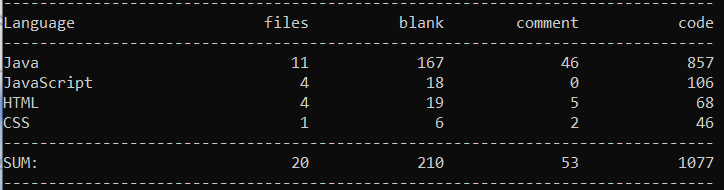

# Projekt: Battle Royal Tetris (Fr/2, Kr)

Name & Praktikumstermin: Jonas Reitz, 5240409 (Fr/1, Kr)

## Inhaltverzeichnis
[Kurzbeschreibung inkl Screenshot](#Kurzbeschreibung-inkl-Screenshot)  
[Beschreibung des Projektaufbaus](#Beschreibung-des-Projektaufbaus)  
[WebApi](#Dokumentation-des-implementierten-WebAPIs)  
[Interface](#Dokumentation-des-interfaces)  
[Technischer Anspruch und Features](#Technischer-Anspruch-(TA)-und-Umsetzung-der-Features)   
[Quellen](#Quellennachweis)  
[Sonstiges](#Sonstiges) 

## Kurzbeschreibung inkl Screenshot

>Kurzbeschreibung
Für den kleinen Zeitvertreib für Zwischendurch oder doch für die große Herausvorderung für Profis.  
Mein Projekt "Battle Royal Tetris" ist für alle Altersgruppen gedacht. Es verbindet das moderne Battle Royal Genre bei dem mehrer Gegner jeder für sich gegeneinander spielen mit dem Klassiker Tetris.
Das Spiel funktioiert genau wie Tetris und mit den Pfeiltasten lassen sich die Steine bewegen und auch drehen. Sobald ein Spieler eine Reihe vervollständigt erscheinen volle Reihen bei den anderen Spielern.  
Wer als letzes noch im Spiel ist gewinnt!  
Um Spielen zu können muss zunächst über das Registrierungsformular ein Benutzer erstellt werden, welcher sich dann mit den entsprechend richtigen Daten im Login Menu anmelden kann.  
Man betritt direkt die Lobby und wartet nun das die entsprechende Anzahl an Spielern beitritt und das Spiel dann automatisch startet.  

**Hinweise**: _Die Anzahl der Spieler lässt sich über die_ `settings.txt` _in dem "/res" Ordner einstellen. Bei einem Spieler bitte_ `debugmode = true` _setzen, da ansonsten einzelne Spieler direkt gewonnen hat._  
Weitere Hinweise bei [Sonstiges](#Sonstiges)

## Beschreibung des Projektaufbaus

### Abgabedateien (LOC)

Verlinkter Dateiname | Dateiart | LOC
---------------------|----------|-----
[bootstrap.css](src/main/resources/public/js/lib/bootstrap-4.3.1-dist/css/bootstrap.css)                           |CSS|8832
[jquery-3.4.1.js](src/main/resources/public/js/lib/jquery-3.4.1.js)                                                  |Javascript|6801
[bootstrap.bundle.js](src/main/resources/public/js/lib/bootstrap-4.3.1-dist/js/bootstrap.bundle.js  )                    |Javascript|4493
[bootstrap-grid.css](src/main/resources/public/js/lib/bootstrap-4.3.1-dist/css/bootstrap-grid.css)                        |CSS|3511
[bootstrap.js](src/main/resources/public/js/lib/bootstrap-4.3.1-dist/js/bootstrap.js       )                        |Javascript|3262
[bootstrap-reboot.css](src/main/resources/public/js/lib/bootstrap-4.3.1-dist/css/bootstrap-reboot.css   )                    |CSS| 267
[Board.java](src/main/java/game/Board.java      )                                                                  |Java|181
[Lobby.java](src/main/java/game/Lobby.java     )                                                                  |Java|112
[App.java](src/main/java/main/App.java        )                                                                 |Java|97
[Shape.java](src/main/java/game/Shape.java        )                                                              |Java|95
[DatabaseManager.java](src/main/java/main/DatabaseManager.java   )                                                           |Java|68
[LogUI.java](src/main/java/main/LogUI.java           )                                                             |Java|65
[ShapePrefab.java](src/main/java/game/ShapePrefab.java      )                                                            |Java|58
[game.js](src/main/resources/public/js/game.js      )                                                           |Javascript|53
[style.css](src/main/resources/public/style.css        )                                                          |CSS|46
[Settings.java](src/main/java/main/Settings.java            )                                                         |Java|26
[index.html](src/main/resources/public/index.html        )                                                         |HTML|25
[register.html](src/main/resources/public/register.html       )                                                       |HTML|21
[Javascript.js](src/main/resources/public/js/Javascript.js     )                                                      |Javascript|21
[login.js](src/main/resources/public/js/login.js          )                                                      |Javascript|18
[login.html](src/main/resources/public/login.html            )                                                     |HTML|17
[register.js](src/main/resources/public/js/register.js        )                                                     |Javascript|14
[DatabaseException.java](src/main/java/main/DatabaseException.java        )                                                     |Java|12
[PacketProcessor.java](src/main/java/PacketProcessors/PacketProcessor.java  )                                                |Java|5
[game.html](src/main/resources/public/game.html                  )                                                |HTML|5
[bootstrap.min.css](src/main/resources/public/js/lib/bootstrap-4.3.1-dist/css/bootstrap.min.css  )                        |CSS|1
[bootstrap-reboot.min.css](src/main/resources/public/js/lib/bootstrap-4.3.1-dist/css/bootstrap-reboot.min.css   )                |CSS|1
[bootstrap.min.js](src/main/resources/public/js/lib/bootstrap-4.3.1-dist/js/bootstrap.min.js       )                     |Javascript| 1
[jquery-3.4.1.min.js](src/main/resources/public/js/lib/jquery-3.4.1.min.js                     )                            |Javascript|1
[bootstrap-grid.min.css](src/main/resources/public/js/lib/bootstrap-4.3.1-dist/css/bootstrap-grid.min.css )                    |CSS|1
[bootstrap.bundle.min.js](src/main/resources/public/js/lib/bootstrap-4.3.1-dist/js/bootstrap.bundle.min.js )                    |Javascript|1

Außerdem hier noch die Screenshots meiner LOC Zählung erstmal mit den Libraries:
  
und hier ohne :  

Fall Sie diese Zählung wiederholen wollen entfernen Sie bitte den `src/resources/public/js/lib` Ordner, da er die Datein von Bootstrap und JQuery enthält und zum offline arbeiten notwendig waren.

### Testdateien (TST)
Verlinkter Dateiname | Testart | Anzahl der Tests
---------------------|---------|-----------------
[JUnitTest.java](src/test/java/JUnitTest.java ) | JUnit5 | 21

Die Tests werden wie folgt ausgeführt:
Mit `Gradle test` in dem Hauptverzeichnis lassen sich alles Tests automatisch ausführen.

### Aufbau der Anwendung

TODO

## Dokumentation des implementierten WebAPIs

Zum senden von Paketen der Website wird nur eine funktion genutzt, welche sich in der Datei `Javascript.js` befindet und welche in der `index.html` geladen wird.
Die funktion `sendRequest()` nutzt zwei Parameter. Der Erste ist das JSON-Objekt welches zum Server gesendet werden soll.  n
Das zweite ist eine Callback funktion, welche mit der Antwort vom Server als Parameter aufgerufen wird.

Sowohl die Serverseitigen als auch die Clientseitigen Pakete sind alle Strings im JSON Format und beinhalten alle ein `tag:String` Attribut, welches für die Indentifikation des 
Paketes zuständig ist.
Der Server ruft mit dem Objekt die `processEvent()` Methode auf welche eine Instanz eines Funktionalen Interfaces in der Map `Map<String,PacketProcessor> processors` mithilfe des Tag attributs sucht,
und die Methode `JSONObject process(JSONObject obj)` des PacketProcessors mit der Request aufruft und die ensprechende Response and den Client zurä¼ckgibt.  

Die Clientseitigen Packete sind : 

`{tag:'input',key:String}` wobei key rotate,down,left,right oder drop sein kann. Es wird bei jedem keyPressEvent gesendet, wenn die ensprechende Taste eine Funktion hat.  
`{tag:'getCurrentBoard',id:int}` wobei der Integer die SessionId des users ist und so das dazugehörige Spielbrett abfragt. Dies wird in der `game.js` in der `setInterval` Funktion abgefragt.  
`{tag:'login',email:String,password:String}` wobei die Email und das Passwort schlüssel für den Benutzer sind, welche in der Datenbank abgefragt werden. Dies wird mit dem Login Button aufgerufen.  
`{tag:'register',email:String,password:String,username:String}` wobei die Email und das Passwort Schlüssel für den Benutzer sind und der username der Anzeigename. Dies wird mit dem Registrieungs Button aufgerufen.  

Die Antworten vom Server sehen ähnlich aus:  

Antwort auf `input` : `{tag:'input',success:boolean}` wobei der success Wert angibt ob der ausgeführte Zug erlaubt war oder nicht.  
Antwort auf `getCurrentBoard` : `{tag:'board',started:boolean,rows:[][],gameOver:boolean,isWon:boolean,playersAlive:int}` wobei started angibt ob das Spiel gestartet ist,rows ist ein multidimensionales array welches die Steine des Feldes enhält, gameover gibt an, ob der spieler verloren hat,  
isWon ob der Spieler gewonnen hat und playersAlive wie viele Spieler noch im Spiel sind.  
Antwort auf `login` : `{tag:'login',success:boolean}` wobei der success Wert angibt ob die Anmeldung erfolgreich war oder nicht.  
Antwort auf `register` : `{tag:'register',success:boolean}` wobei der success Wert angibt ob die Regestrierung erfolgreich war oder nicht
  
## Dokumentation des Interfaces
TODO
## Technischer Anspruch (TA) und Umsetzung der Features

Ich habe folgende Features verwendet. Die verlinkte Datei zeigt beispielhaft den Einsatz dieses Features in den angegebenen Zeilen im Quellcode.

1.Das Speichern und Laden von Daten aus mehreren Textdateien für die Einstellung des Spiels und das Laden der verschiedenen Spielsteine, [ShapePrefab.java](src/main/java/game/ShapePrefab.java) (30-45)  
2. Bootstrap und JQuery für den Allgemeinen Aufbau der Website, [index.html](src/main/resources/public/index.html) (9-30)  
3. Das JSON Datenformat für die Übertragung der Daten zwischen Client und Server. Dafür habe ich außederdem die Bibliothek org.json für Java genutzt, [Javascript.js](src/main/resources/public/js/Javascript.js) (1-10) [App.java](src/main/java/main/App.java) (32-84)  
4. Das Nutzen einer Datenbank für ein geeignetes Login/Registrieungssystem im Backend, [App.java](src/main/java/main/DatabaseManager.java) (19-103)  

TODO <Ihre Dokumentation zu den Features>
## Quellennachweis

Als Quellen hab ich hauptsächlich das Gruppenprojekt genutzt und mir den von mir geschriebenen Datenbank Code kopiert und an das Projekt angepasst habe.
Desweiteren habe ich Teile useres CSS und HTML Codes für den Grundaufbau der Website genutzt.

Hiermit bestätige ich auch, das die oben genannten Quellen die einzigen sind die ich genutzt habe und der restliche Code alleine von mir geschrieben wurde.

  
## Sonstiges

Für die LOC Zählung bitte nur den src Ordner zählen lassen und die Libraries in srx/main/rescources/public/js/lib weglassen. 
Für Testzwecke lässt sich außerdem die settings.txt in dem Res Ordner bearbeiten und so die Spieleranzahl in einer Lobby verändern. Falls nur ein Spieler
spielen soll bitte auch den DebugMode auf true ändern da ansonsten das Spiel direkt vorbei ist.  

Desweitern bin ich durch die gegeben Vorschriften der LOC an meine Grenzen gestoßen, da ich für das Projekt weitere Dinge geplant hatte die durch die Beschränkung nich umsetzbar waren.
Ich hätte gerne ein Lobby System gemacht in dem man sich aussuchen kann, in welche Lobby man gehen möchte, in der die Spielerzahl variiert. Außerdem sollte es eine Rangliste geben, in dem sich die Spieler anhand ihrer Siege messen können 
und auch Spieler mit mehr Siegen gegeneinander spielen und so ein gewisses Rating System einzubauen.
Außerdem sollten die Benutzernamen und der momentane Feld der gegnerischen Spieler auch angezeigt werden.  
Ich hätte zusätlich noch gerne Animationen und Sounds auf der Website eingebunden, jedoch war durfte der Javascript anteil ja nur bei <10% liegen.  
Es hätte außerdem auch verschiedene Schwierigkeitstufen an Bots gegeben, die die Lobbys nach eine bestimmten Zeit aufgefüllt hätten, wenn diese nich voll gewesen wäre.
Außerdem hätte ich gerne den Cookie Store genutz, damit die Spieler auch nach dem Schlißen der Website eingeloggt blieben.  

Das Spiel funktioniert super in mehreren Tabs, so das man für Testzwecke sich einfach mehrmals anmelden kann und eine Lobby fällt.  
Getestete Browser sind Chrome und Firefox, wobei andere Browser eigentlich kein Problem sein dürften da keine all zu Speziellen Features eines Browsers genutzt wurden.

