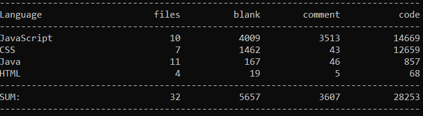

# Projekt: Battle Royal Tetris (Fr/2, Kr)

Name & Praktikumstermin: Jonas Reitz, 5240409 (Fr/1, Kr)

## Inhaltverzeichnis
[Kurzbeschreibung](#Kurzbeschreibung-inkl-Screenshot)  
[Screenshot](#Screenshot)  
[Beschreibung des Projektaufbaus](#Beschreibung-des-Projektaufbaus)  
[WebApi](#WebApi)  
[Interface](#Interface)  
[Features](#Features)  
[Sonstiges](#Sonstiges)  
[Quellen](#Quellen)  

## Kurzbeschreibung inkl Screenshot

>Kurzbeschreibung
Für den kleinen Zeitvertreib für Zwischendurch oder doch für die große Herausvorderung für Profis.  
Mein Projekt "Battle Royal Tetris" ist für alle Altersgruppen gedacht. Es verbindet das moderne Battle Royal Genre bei dem mehrer Gegner jeder für sich gegeneinander spielen mit dem Klassiker Tetris.
Das Spiel funktioiert genau wie Tetris und mit den Pfeiltasten lassen sich die Steine bewegen und auch drehen. Sobald ein Spieler eine Reihe vervollständigt erscheinen volle Reihen bei den anderen Spielern.  
Wer als letzes noch im Spiel ist gewinnt!  
Um Spielen zu können muss zunächst über das Registrierungsformular ein Benutzer erstellt werden, welcher sich dann mit den entsprechend richtigen Daten im Login Menu anmelden kann.  
Man betritt direkt die Lobby und wartet nun das die entsprechende Anzahl an Spielern beitritt und das Spiel dann automatisch startet.  

**Hinweise**: _Die Anzahl der Spieler lässt sich über die_ `settings.txt` _in dem "/res" Ordner einstellen. Bei einem Spieler bitte_ `debugmode = true` _setzen, da ansonsten einzelne Spieler direkt gewonnen hat._  
Weitere Hinweise bei [Sonstiges](#Sonstiges)

## Beschreibung des Projektaufbaus

### Abgabedateien (LOC)

Verlinkter Dateiname | Dateiart | LOC
---------------------|----------|-----
[bootstrap.css](src/main/resources/public/js/lib/bootstrap-4.3.1-dist/css/bootstrap.css)                           |CSS|8832
[jquery-3.4.1.js](src/main/resources/public/js/lib/jquery-3.4.1.js)                                                  |Javascript|6801
[bootstrap.bundle.js](src/main/resources/public/js/lib/bootstrap-4.3.1-dist/js/bootstrap.bundle.js  )                    |Javascript|4493
[bootstrap-grid.css](src/main/resources/public/js/lib/bootstrap-4.3.1-dist/css/bootstrap-grid.css)                        |CSS|3511
[bootstrap.js](src/main/resources/public/js/lib/bootstrap-4.3.1-dist/js/bootstrap.js       )                        |Javascript|3262
[bootstrap-reboot.css](src/main/resources/public/js/lib/bootstrap-4.3.1-dist/css/bootstrap-reboot.css   )                    |CSS| 267
[Board.java](src/main/java/game/Board.java      )                                                                  |Java|181
[Lobby.java](src/main/java/game/Lobby.java     )                                                                  |Java|112
[App.java](src/main/java/main/App.java        )                                                                 |Java|97
[Shape.java](src/main/java/game/Shape.java        )                                                              |Java|95
[DatabaseManager.java](src/main/java/main/DatabaseManager.java   )                                                           |Java|68
[LogUI.java](src/main/java/main/LogUI.java           )                                                             |Java|65
[ShapePrefab.java](src/main/java/game/ShapePrefab.java      )                                                            |Java|58
[game.js](src/main/resources/public/js/game.js      )                                                           |Javascript|53
[style.css](src/main/resources/public/style.css        )                                                          |CSS|46
[Settings.java](src/main/java/main/Settings.java            )                                                         |Java|26
[index.html](src/main/resources/public/index.html        )                                                         |HTML|25
[register.html](src/main/resources/public/register.html       )                                                       |HTML|21
[Javascript.js](src/main/resources/public/js/Javascript.js     )                                                      |Javascript|21
[login.js](src/main/resources/public/js/login.js          )                                                      |Javascript|18
[login.html](src/main/resources/public/login.html            )                                                     |HTML|17
[register.js](src/main/resources/public/js/register.js        )                                                     |Javascript|14
[DatabaseException.java](src/main/java/main/DatabaseException.java        )                                                     |Java|12
[PacketProcessor.java](src/main/java/PacketProcessors/PacketProcessor.java  )                                                |Java|5
[game.html](src/main/resources/public/game.html                  )                                                |HTML|5
[bootstrap.min.css](src/main/resources/public/js/lib/bootstrap-4.3.1-dist/css/bootstrap.min.css  )                        |CSS|1
[bootstrap-reboot.min.css](src/main/resources/public/js/lib/bootstrap-4.3.1-dist/css/bootstrap-reboot.min.css   )                |CSS|1
[bootstrap.min.js](src/main/resources/public/js/lib/bootstrap-4.3.1-dist/js/bootstrap.min.js       )                     |Javascript| 1
[jquery-3.4.1.min.js](src/main/resources/public/js/lib/jquery-3.4.1.min.js                     )                            |Javascript|1
[bootstrap-grid.min.css](src/main/resources/public/js/lib/bootstrap-4.3.1-dist/css/bootstrap-grid.min.css )                    |CSS|1
[bootstrap.bundle.min.js](src/main/resources/public/js/lib/bootstrap-4.3.1-dist/js/bootstrap.bundle.min.js )                    |Javascript|1

Außerdem hier noch die Screenshots meiner LOC Zählung erstmal mit den Libraries:
  
und hier ohne :  

Fall Sie diese Zählung wiederholen wollen entfernen Sie bitte den `src/resources/public/js/lib` Ordner, da er die Datein von Bootstrap und JQuery enthält und zum offline arbeiten notwendig waren.

### Testdateien (TST)
Verlinkter Dateiname | Testart | Anzahl der Tests
---------------------|---------|-----------------
[JUnitTest.java](src/test/java/JUnitTest.java ) | JUnit5 | 21

Die Tests werden wie folgt ausgeführt:
Mit `Gradle test` in dem Hauptverzeichnis lassen sich alles Tests automatisch ausführen.
